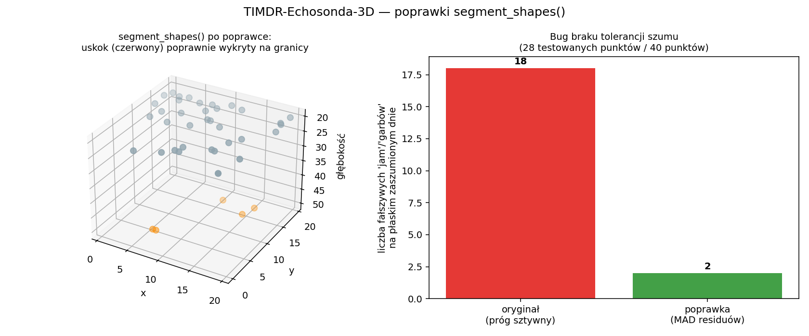
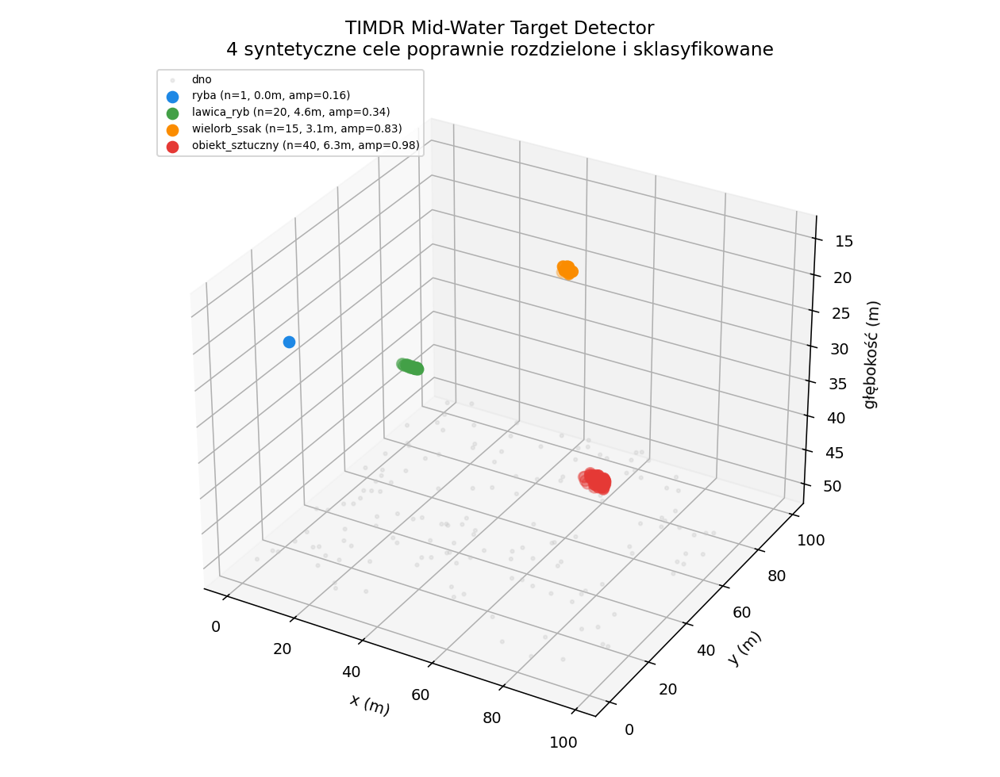

# TIMDR-Echosonda-3D + Mid-Water Target Detector

Dwa moduły:
- **`timdr_echosonda_3d.py`** — analiza chmury punktów dna (batymetria):
  gradient powierzchni, detekcja uskoków/krawędzi, wygładzanie, krzywizna,
  segmentacja kształtów dna (ze zgłoszenia, przetestowany i naprawiony)
- **`timdr_midwater_targets.py`** — detekcja celów w toni wodnej: ryby,
  ławice, ssaki morskie, obiekty sztuczne (nowy moduł, na prośbę "dodaj
  ryby wieloryby statki podwodne")

## Status

`timdr_echosonda_3d.py`: 10/10 testów. `timdr_midwater_targets.py`:
7/7 testów (razem 17/17). Znalezione i naprawione w oryginalnym kodzie:
3 błędy, w tym jeden powodujący `inf`/`NaN` na dosłownie własnym
przykładzie ze zgłoszenia.

## 🐛 Błędy znalezione w oryginalnym `timdr_echosonda_3d.py`

### 1. `flow_3d()` / `twist_3d()` — dzielenie przez zero na własnym przykładzie

```python
dzdx = np.gradient(z, x)
dzdy = np.gradient(z, y)
```

`np.gradient(z, y)` zakłada, że punkty leżą w kolejności na siatce/linii
wzdłuż `y`. **Przykład ze zgłoszenia ma `y=0` dla wszystkich punktów** —
`np.gradient` dzieli przez zero, cała kolumna `dzdy` wychodzi `inf`, a w
konsekwencji `twist_3d()` (który liczy `np.gradient(flow, ...)` na tych
danych) zwraca same `NaN` i **pusty `twist_points`**, mimo że przykład ma
jawnie zakodowany uskok (`[3, 0, 40]` po `[2, 0, 15]`). Zweryfikowano
uruchomieniowo — RuntimeWarning "divide by zero" na dosłownie tym
przykładzie z opisu zgłoszenia.

Głębszy problem: to samo podejście jest źle postawione dla **każdej**
prawdziwej, rozrzuconej chmury punktów (multibeam sonar), nie tylko dla
przypadku `y=const`. Zweryfikowano na syntetycznej płaszczyźnie pochyłej
o znanym gradiencie `[0.5, 0.0]`: oryginalny kod dawał `dzdy` w zakresie
**[-13.1, +9.3]** zamiast stałego 0.0.

**Naprawiono:** lokalne dopasowanie płaszczyzny metodą najmniejszych
kwadratów do k najbliższych sąsiadów (KDTree — ta sama technika, którą
oryginalny kod już poprawnie stosował w `trm_surface`). Zweryfikowano:
błąd < 1e-6 na testowej płaszczyźnie, wynik niezmienniczy na kolejność
punktów wejściowych.

### 2. `curvature()` — zależy od kolejności punktów w tablicy, nie od geometrii

```python
d2 = np.gradient(np.gradient(z))
```

Całkowicie ignoruje `x`, `y`. Zweryfikowano: **ta sama** chmura punktów
(ta sama fizyczna powierzchnia), tylko w innej kolejności w liście
wejściowej, dawała **inne** wartości krzywizny (np. punkt 0: `0.5` vs
`-4.0`). Krzywizna geometryczna nie może zależeć od kolejności wczytania
punktów. Naprawiono: lokalne dopasowanie powierzchni kwadratowej do k
najbliższych sąsiadów, krzywizna = Laplasjan dopasowania (standardowe
podejście w analizie terenu/GIS). Zweryfikowano: zero na płaszczyźnie,
niezmiennicze na permutację punktów.

### 3. `segment_shapes()` — brak tolerancji szumu (64% fałszywych alarmów)



Warunki `mid < left` / `mid > left` używały ostrej nierówności bez progu
szumu (tylko "półka" miała sztywny próg `0.1`). Zweryfikowano na płaskim
dnie z typowym szumem sonaru (~2cm): oryginalny kod klasyfikował **18 z
28** testowanych punktów jako fałszywe "jamy"/"garby" — 64% fałszywych
alarmów na kompletnie płaskim dnie.

Naprawiono dwuetapowo:
- indeksy tablicy zastąpione prawdziwym sąsiedztwem przestrzennym (KDTree)
- próg szumu liczony jako MAD reszt z lokalnego dopasowania płaszczyzny
  (nie surowe `std(z)` całej chmury — **ważne**: gdy dno ma prawdziwą,
  wielkoskalową strukturę, np. uskok podnoszący połowę obszaru o 30m,
  `std(z)` jest zdominowane przez tę strukturę (zweryfikowano: 14.9
  zamiast realnego szumu ~0.02) i próg oparty na tym maskuje wszystkie
  realne cechy terenu. MAD reszt lokalnego dopasowania płaszczyzny jest
  odporny na to, bo płaszczyzna "wchłania" wielkoskalowy trend.

Zweryfikowano: 0/40 fałszywych cech na płaskim zaszumionym dnie **oraz**
poprawne wykrycie prawdziwego przestrzennego uskoku 30m (5/5 punktów przy
granicy).

## 🐟 Nowy moduł: `timdr_midwater_targets.py`

Detekcja celów w toni wodnej wymaga innych danych niż analiza dna —
**surowych ech sonaru** (wszystkie odbicia, nie tylko już-wyznaczone dno),
bo cel wodny to z definicji echo, które nie pochodzi od dna. Oryginalny
moduł operował tylko na `[x, y, depth]` reprezentującym gotową
powierzchnię dna — bez modelu na dodatkowe zwroty z toni nie da się w
ogóle odróżnić ryby od dna. Dlatego to osobna klasa, nie dopisek do
`TIMDREchosonda3D`.

**Pipeline:** `detect_targets()` (odrzuca zwroty leżące na/blisko dna,
zostawia tylko te wyraźnie płycej) → `cluster_targets()` (DBSCAN grupuje
pojedyncze zwroty w cele) → `classify_targets()` (zgrubna heurystyka wg
rozmiaru skupiska i średniej amplitudy echa).



Zweryfikowano na 4 syntetycznych celach o rosnącym rozmiarze/sile echa:
pojedyncza ryba (n=1, ~0m, amp=0.16) → poprawnie "ryba"; ławica (n=20,
4.6m, amp=0.34) → "lawica_ryb"; wieloryb (n=15, 3.1m, amp=0.83) →
"wielorb_ssak"; duży sztywny obiekt (n=40, 6.3m, amp=0.98) →
"obiekt_sztuczny". Wszystkie 4 poprawnie rozdzielone przez DBSCAN i
sklasyfikowane zgodnie z oczekiwaniem.

### ⚠️ Uczciwe zastrzeżenie o klasyfikacji

To jest **zgrubna heurystyka** oparta wyłącznie na rozmiarze skupiska
punktów i średniej amplitudzie echa, skalibrowana na danych
**syntetycznych**. To NIE jest zamiennik prawdziwej klasyfikacji celów
sonarowych — te w praktyce (marynarka, hydrografia, akustyka rybacka)
używają widma czasowo-częstotliwościowego echa (target strength vs
częstotliwość), śledzenia wielo-pingowego (tor i prędkość celu, sygnatura
Dopplera) i uczenia maszynowego na kształcie fali powrotnej. Progi w
`classify_targets()` (`size_m < 1.0`, `mean_amplitude < 0.5` itd.) to
punkt startowy do kalibracji na prawdziwych danych z Twojego sonaru, nie
zwalidowana norma — realny sonar, głębokość, typ dna i gatunek ryb wpłyną
na sensowne wartości progów.

## Przykład użycia

```python
from timdr_echosonda_3d import TIMDREchosonda3D
from timdr_midwater_targets import TIMDRMidWaterDetector

ech = TIMDREchosonda3D(k_neighbors=12)
points = [[0,0,10],[1,0,12],[2,0,15],[3,0,40],[4,0,42],[5,0,43]]
twist_pts, _ = ech.twist_3d(points)
segments = ech.segment_shapes(points, twist_pts)

# cele wodne wymagaja osobno chmury dna i surowych ech [x,y,depth,amplitude]
det = TIMDRMidWaterDetector(bottom_points=points)
returns = [[2, 0, 5.0, 0.4]]  # echo wyraznie plycej niz dno
targets = det.detect_targets(returns, min_clearance=1.0)
labels, _ = det.cluster_targets(targets)
print(det.classify_targets(targets, labels))
```

Uruchomienie: `python demo.py` / testy: `pytest -q`.
